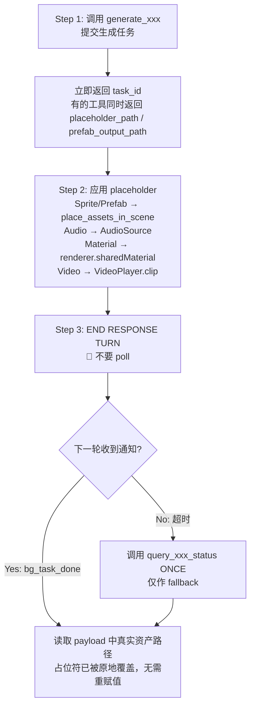

# Generator 异步通用纪律（公共模板）

> **范围**：所有 `generate_*` skill 与 `search_assets` skill 共享的异步任务执行约定。  
> **使用方式**：各 skill 的 `SKILL.md` 顶部用一行引用本模板，不再重复展开通用纪律。
> 
> ```markdown
> ## 异步通用纪律
> 
> 本 skill 为异步任务，遵守 [generator-async-pattern](../../experience/templates/generator-async-pattern.md)。
> 关键约束：POLLING FORBIDDEN、提交后 END RESPONSE TURN、等待 `<bg_task_done>` 通知。
> 仅以下细节为本 skill 独有：
> - 工具名：`generate_xxx` / `query_xxx_status` / `list_xxx_tasks`
> - 估计耗时：~XX 秒
> - fallback 超时：XX 秒
> - 通知 payload 独有字段：xxx_path / xxx_url ...
> ```

---

## 1. 通用工作流（所有 generator skill 共用）



## 2. 🚫 POLLING IS STRICTLY FORBIDDEN

不论 skill 名为何，以下行为**全部禁止**：

- ❌ 在循环里调用 `query_xxx_status`
- ❌ 用 `time.sleep` 等待状态
- ❌ 在同一回合内多次调用同一 task_id 的查询工具
- ❌ "保险起见再查一次"

正确动作：

- ✅ 提交任务后**立即结束当前回合**
- ✅ 等下一轮的 `<bg_task_done>` 通知自动到达
- ✅ 仅在通知超时（见下表）后调用 `query_xxx_status` **一次**作为最后兜底

## 3. fallback 超时表

| 任务类型 | 典型耗时 | fallback 超时（无通知后才允许 query 一次） |
|---|---|---|
| 短任务（material / skybox / audio / sprite / image） | 1–3 分钟 | 120 秒 |
| 中任务（sprite_sequence / sound_effect） | 1–3 分钟 | 120 秒 |
| 长任务（3d_model / animated_character / terrain / video） | 3–15 分钟 | 300 秒 |
| 复合任务（rigged_animated_model A/B/C） | 1–5 分钟 | 300 秒 |
| 资产下载（search_assets） | 30 秒–几分钟 | 120 秒（每个 task_id 仅 ONCE） |

各 skill 在自己的 SKILL.md 内只需声明本 skill 落在哪一档。

## 4. `<bg_task_done>` 通知通用字段

所有 generator 通知都包含以下字段：

| 字段 | 说明 |
|---|---|
| `tool_name` | 来源工具名 |
| `task_id` | 提交时返回的 task_id |
| `backend_task_id` | 后端任务 id（domain reload 恢复时用于匹配） |
| `session_id` | 会话 id；空字符串时表示 domain reload 恢复路径 |
| `status` | `"completed"` / `"failed"` |
| `progress` | 完成时为 `100` |
| `start_time` / `end_time` | `"yyyy-MM-dd HH:mm:ss"` |
| `duration_seconds` | int |
| `error` | 失败时的错误信息 |

**额外字段**（如 `model_path` / `video_path` / `prefab_path` / `material_path` / `audio_path` / `heightmap_path` / `rigged_model_path` / `motion_fbx_path`）由各 skill 在自己的 SKILL.md 中列出。

> 重要：通知到达后，**不要**再调用 `query_xxx_status`。若 `session_id == ""`，按 `task_id` 或 `backend_task_id` 匹配。

## 5. Placeholder 工作流（适用于会返回 placeholder_path / prefab_output_path 的工具）

提交任务时，工具会立即返回一个**最小占位资产**。规则：

1. **提交后立即应用占位资产**：把 placeholder 赋给 VideoPlayer / 实例化 placeholder Prefab / 应用 placeholder Material。
2. **不要等生成完成再做集成工作**——先把场景搭起来。
3. **生成完成时占位文件被原地覆盖**——已经引用 placeholder 路径的组件会自动指向真实资产，无需手动重赋值。
4. **真实路径 == 占位路径**：通知 payload 中的 `xxx_path` 与提交时的 `placeholder_path` 是同一个文件路径（同一物理文件，内容更新）。

## 5.1 ⛔ `place_assets_in_scene` 调用规则

适用于**所有**返回 placeholder 的 `generate_*` 工具，以及 `search_assets`。**核心约束：每个资产路径最多调用一次。**

1. **必须调用一次**：
   - `generate_*`（有 placeholder）：拿到 `placeholder_path` / `prefab_output_path` 后**立即**放占位。
   - `generate_*`（无 placeholder，如 `generate_sprite_sequence`）：等 `<bg_task_done>` 拿到真实资产路径后**调一次**。
   - `search_assets`：pipeline Step 4 **必须执行**——对每个最终 `prefab_path` 调一次（`download_asset` 响应里的 `skipped` 任务路径和 `<bg_task_done>` 通知里的路径合并去重）。
2. **`<bg_task_done>` 到达后不要再调**：generator 的资产文件已**原地覆盖**（GUID/路径不变），场景里已实例化的引用自动指向真实资产；search_assets 同一 `prefab_path` 不能放两次。
3. **Final Report 里不要问"需要我放到场景中吗？"**——告诉 caller 资产已经在场景里（给出 GameObject 名）。
4. **例外**：仅当用户**明确要求**"换位置 / 换 scale / 再加一个实例"时，才允许再次调用。

> 典型违规症状：**场景里出现多个相同的实例**（Prefab/Sprite/RawImage/AudioSource 重复 2–3 份）——通常是 placeholder 阶段调一次 + 通知到达后又调一次 + 主 agent 看到 `xxx_path` 又调一次。不确定时先用 `unity_scene(action="list")` 或 `GameObject.Find` 检查（见 [sub-agent-common §6](sub-agent-common.md#6-duplicate-check适用于会创建场景对象的-agent)）。

## 6. Domain Reload Recovery

Unity 编译脚本/进入 Play Mode 等动作会触发 domain reload，可能：

- 清空 in-memory task 状态
- 中断后台任务

恢复策略（按优先级）：

1. **优先信任 `<bg_task_done>` 自动重发机制**：C# host 在 reload 后会从 `InterruptedTasks.json` 重新触发通知，正常等待即可。
2. **若通知超时仍未到达** → 调用 `query_xxx_status` **一次**。
3. **若 query 也找不到 task** → 检查输出目录（`Assets/TJGenerators/History/` 等）是否存在符合命名规则的资产文件，按"文件大小判定规则"判断状态。
4. **状态为 `interrupted`** → 后端记录已丢失，需要重新提交（`force_overwrite=true` 等参数视具体工具而定）。

### 文件大小判定规则（通用）

- **`< 1 KB` → 仍是 placeholder**（所有 skill 一致）。任务未完成或已丢失，重新生成。
- **`≥ skill 阈值` → 真实文件已就绪**。各 skill 阈值不同（image ≥ 50 KB、material ≥ 100 KB、sprite ≥ 200 KB、skybox ≥ 500 KB、audio ≥ 1 MB、video ≥ 100 KB……），见各自 SKILL.md。
- 复合产物（Prefab + 子节点 / Sequence 目录 / Terrain + TerrainData）的判定由各 skill 自定义结构特征。

## 7. ⛔ Play Mode 禁令

所有 generator skill 与对应 sub-agent **严禁**在执行期间进入 Play Mode：

- 进入 Play Mode 会锁定 `Assembly-CSharp.dll` 触发 domain reload
- 多 agent 并发时会引起跨任务连锁失败
- 验证应在 Edit Mode 下用 `execute_csharp_script` 检查组件状态

### 例外白名单

| Skill / Agent | 例外原因 | 约束 |
|---|---|---|
| `generate_video` Scene-to-Video 工作流 | 截图作为 `reference_image` **任务输入**,必须在 Play Mode 下渲染一帧 | Play Mode 保持 ≤ 2 秒,只为捕捉一帧;`text_to_video` 与 `reference_image_from_file` 路径仍禁 |

文档中其它出现的 "Play Mode" 字样大多描述**用户/运行时**行为(例如 "用户进 Play Mode 即可看到动画循环")或 AudioSource 字段说明,不是 agent 动作,不构成例外。

## 8. 通用 Status 枚举与修复动作

| Status | 含义 | 修复动作 |
|---|---|---|
| `submitted` / `pending` | 已提交，未开始执行 | 等待即可 |
| `generating` / `processing` / `downloading` / `importing` / `rigging` / `generating_motion` / `applied` | 各 skill 各自定义的"进行中"状态 | 按 §3 fallback 表等待，**不要** poll |
| `recovering` | domain reload 中，自动恢复中 | 等编译完成；**不要** cancel 任务 |
| `completed` | 全部输出就绪 | — |
| `failed` | 生成失败 | 看 `error` 字段；按各 skill 独有故障表处置 |
| `interrupted` | 后端记录丢失 | 用相同输入 + `force_overwrite=true`（若支持）重新提交；具体参数见各 skill |
| `skipped` | 资产已存在（仅 search_assets），路径直接可用，无通知 | — |
| Task not found | 60 分钟过期 / Editor 重启 | `list_xxx_tasks` 看活跃任务；若不存在则重新生成 |

## 9. 各 skill SKILL.md 应保留的独有内容

抽出本模板后，各 generator SKILL.md 仍应详细写：

- skill 适用场景与触发关键词（frontmatter `description`）
- 工具签名与参数表（`generate_xxx` 的 parameters）
- prompt / image_path / 各类生成参数的写作指南
- 通知 payload 的**独有字段**（如 `video_path` / `model_path`）
- skill 特有的工作流（如 generate_video 的 Scene-to-Video、generate_terrain 的 apply_terrain_heightmap 二段式）
- skill 特有的故障排查（如 video 的"占位/真实文件大小判定"）
- 各 skill 的 prompt 模板范例

**不应再重复**：通用 polling 禁令、通用通知字段、通用 fallback 超时规则、通用 domain reload 流程、通用 Play Mode 禁令、通用故障排查（§10）——一律改为 *"详见 [generator-async-pattern](...)"*。

## 10. 通用故障排查

以下故障**所有 `generate_*` skill 共享**，各 skill 的故障排查表不再重复，直接在表前一行引用本节：

> 通用故障（配置缺失 / 任务卡住 / 状态异常 / 未登录）见 [generator-async-pattern §10](../../experience/templates/generator-async-pattern.md#10-通用故障排查)。

| 问题 | 原因 | 解决 |
|---|---|---|
| `Cannot find <xxx> generator config for '<id>'` | TJGenerators 未安装 / 配置缓存未刷新 | 确认 `cn.tuanjie.ai.generators` 在 `Packages/manifest.json` 中；菜单 **AI生成 → 清除配置缓存并重新加载** |
| 提交失败 `AUTH_REQUIRED` | 未登录 Unity Connect | 打开 **Window → Unity Connect** 登录 |
| Task 卡在 `generating` / `processing` | 网络 / 后端排队 | 按 §3 fallback 超时表等待；超过对应档位才允许 `list_xxx_tasks` ONCE，**不要 poll** |
| 状态显示 `recovering` | Editor 编译触发 domain reload | 等编译完成；**不要** cancel 任务 |
| 状态显示 `interrupted` | 后端记录丢失 | 用相同输入 + `force_overwrite=true`（若工具支持）重新提交 |
| `Task not found` | 60 分钟过期 / Editor 重启 / domain reload | `list_xxx_tasks` 看活跃任务；不存在则按 §6 文件大小判定恢复，仍丢失则重新生成 |
| 输出文件 `< 1 KB` | 仍是 placeholder | 见 §6 文件大小判定规则；任务可能未完成或已丢失 |
| Unity 编辑器 **TJGenerators 主面板** 持续显示 `Processing...` / 灰色占位图，但 `<bg_task_done>` 已到达、Prefab/资产已就绪 | TJGenerators UPM 包面板 UI 没刷新（独立 bug，不影响生成结果） | **以 `<bg_task_done>` 通知 + 资产文件实际内容为准**；不要因为面板还在转就重新提交、轮询或长时间等待 |
