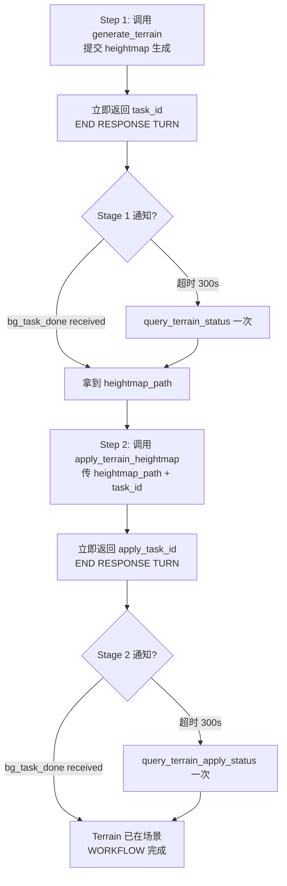

> ⚠️ **执行约束**（**当前无专属子代理**）
> - **主 agent**：无 `execute_custom_tool` 权限。任选其一委托：
>   1. `task(subagent_name="general-purpose", ...)` 把任务委给通用子代理（其有 `execute_custom_tool` 权限）；
>   2. 或临时在 `agents/` 下新增 `terrain-generator.toml`（allowed_tools 含 `execute_custom_tool`，allowed_skills 含 `unity-terrain-generation`）后委托。
>   不要主 agent 直接 `activate_skill` 后调 `execute_custom_tool`，会报"自定义工具未注册"。
> - **子代理（本文档主要读者）**：有权限，按下方 `execute_custom_tool(...)` 示例执行。

# Generate Unity Terrain 🏔️

用 **Frontier** AI 生成灰度高度图，再自动应用到当前场景生成 Unity Terrain。

输出：场景中的 **Terrain GameObject** + `TerrainData` 资产 + 后处理过的 heightmap PNG，全部保存到 `Assets/TJGenerators/History/`。

> **模型固定**：Frontier 是唯一支持的 generator——无 `generator_id` 参数；aspect ratio 固定 1:1，不可配置。

## 🚦 执行流程（两阶段，不要跳读外链）

**Stage 1（heightmap 生成）**：
1. 调 `generate_terrain` → 拿 `task_id_1` + `placeholder_path`（1×1 灰，仅占位，不要 place）
2. **END RESPONSE TURN** — 不要 poll、不要 `query_terrain_status`
3. 下一轮收到 `<bg_task_done>` → 读 `heightmap_path`

**Stage 2（应用到场景）**：
4. **立即**调 `apply_terrain_heightmap`（传 Stage 1 的 `heightmap_path`）→ 拿 `task_id_2`
5. **END RESPONSE TURN** — 不要 poll、不要 `query_terrain_apply_status`
6. 下一轮收到 `<bg_task_done>` → Terrain 已在场景，workflow 完成

**档位**：Stage 1 30–90 秒（fallback 120 秒）；Stage 2 60–180 秒（fallback 300 秒）。除非用户明确说"只生成高度图"，否则两段必须串完。完整 async 规则见 [generator-async-pattern](../../experience/templates/generator-async-pattern.md)。

## ⚠️ Skill 独有约束

1. **必须串两段，不能只跑一段**——除非用户明确说"只生成高度图"。默认 AI agent 端到端自动完成：Stage 1 通知到达 → 立即调 `apply_terrain_heightmap` → Stage 2 通知到达 → workflow 完成。
2. **不要在两段之间 polling**——通用纪律是"等通知"，本 skill 也一样。原 polling 写法（`time.sleep` 循环）已被 `<bg_task_done>` 替代。
3. **`task_id` 与 `apply_task_id` 必须区分**——前者来自 Stage 1，后者来自 Stage 2，**不可混用**。Stage 2 的 query 工具只接受 `apply_task_id`。
4. **强烈建议给 `apply_terrain_heightmap` 传 `task_id`**——开启**幂等保护**：同一 `task_id` 已 apply 过会立即返回 `already_applied: true`，避免在场景里建多个重复 Terrain。
5. **绝不要用 `placeholder_path` 喂给 `apply_terrain_heightmap`**——必须用通知 / query 拿到的真实 `heightmap_path`（同名但内容不同）。placeholder 是 1×1 stub，apply 会失败。
6. **Stage 2 处理中不要重试**——通知没到时，先看 `elapsed_seconds`：< 300 秒一律继续等；只在 `failed` 或 > 300 秒才考虑重试 `apply_terrain_heightmap`。
7. **并发上限 5**（仅 Stage 1）——同时运行的 terrain 生成任务最多 5 个。
8. **`generate_terrain` 不可配 aspect ratio**——总是 1:1 方形 heightmap。

## When to Use / NOT to Use

适用：山脉、峡谷、平原、丘陵、岛屿、火山、沙丘、海岸悬崖等大尺度地形 / 地貌。任何"地面 / 环境形状"而不是独立物件，都用本 skill。

不适用：
- 3D 物件（树、岩石、建筑） → `generate_3d_model`
- 天空盒 / 环境背景 → `generate_skybox`
- 通用图片 / 纹理 → `generate_image`
- 2D 精灵 → `generate_sprite`

## 工作流



> 仅当用户明确说"只生成高度图，先不要放到场景里" / "I'll apply it myself" / "分步执行"时，才停在 Stage 1 不进 Stage 2。

## 工具

所有工具通过 `execute_custom_tool` 调用。

### Stage 1：`generate_terrain`

```python
result = execute_custom_tool(
    tool_name="generate_terrain",
    parameters={
        "prompt": "rugged mountain range with steep peaks and valleys",
        "image_path": "Assets/ref_heightmap.png",  # 可选：参考图（强烈影响形状）
        "resolution": "2K",                        # "1K" / "2K" / "4K"，默认 "2K"
        # output_path: 不建议指定，默认 Assets/TJGenerators/History/
    }
)
```

**返回字段**：
- `task_id`（Stage 1 标识）
- `placeholder_path`：1×1 灰色 PNG，**不要**直接喂给 apply
- `backend_task_id`、`status: "submitted"`
- `estimated_wait_seconds` ≈ 60
- `notification_mode: "bg_task_done"`

### Stage 1 `<bg_task_done>` 独有字段

通用字段见模板。本阶段额外字段：

| 字段 | 说明 |
|---|---|
| `heightmap_path` | 真实 heightmap PNG 路径（**这个**才能喂给 apply，不要用 placeholder） |
| `preview_url` | 预览 URL 或本地路径 |
| `prompt` | 原始 prompt |

> **收到此通知后立即调 `apply_terrain_heightmap`**（除非用户明确说不要）。**不要**调 `query_terrain_status`。

### Stage 2：`apply_terrain_heightmap`

```python
apply_result = execute_custom_tool(
    tool_name="apply_terrain_heightmap",
    parameters={
        "heightmap_path": "Assets/TJGenerators/History/Terrain_xxx.png",  # required
        "task_id": task_id,             # ⚠️ 强烈建议：开启幂等保护
        "use_default_options": True,    # true = 一键最佳预设；false = 手动调 15 个后处理参数
        "terrain_go_name": "TJGenerators Terrain",
        # 高级后处理参数（仅 use_default_options=False 时生效），见后文表格
    }
)
```

**立即返回**（< 1 秒）：
- `apply_task_id`（Stage 2 标识，**不同于** Stage 1 的 `task_id`）
- `status: "processing"`
- `next_poll_after_seconds: 15`、`max_wait_before_retry_seconds: 300`
- `notification_mode: "bg_task_done"`

**幂等保护**：如果 `task_id` 之前已 apply 过：

```json
{
  "success": true,
  "already_applied": true,
  "terrain_data_path": "...",
  "terrain_go_name": "...",
  "message": "Terrain already applied. WORKFLOW COMPLETE."
}
```
→ 不要再调，workflow 已完成。

### Stage 2 `<bg_task_done>` 独有字段

| 字段 | 说明 |
|---|---|
| `heightmap_path` | 被应用的 heightmap PNG（即 Stage 1 的输出） |
| `terrain_data_path` | 生成的 TerrainData asset 路径 |
| `terrain_go_name` | 场景中创建的 Terrain GameObject 名 |

> 收到此通知 = workflow 全部完成。**不要**调 `query_terrain_apply_status`。

### Fallback Query 工具

仅当通知超时（300 秒）才调用，**仅一次**：

| 工具 | 输入 | 用途 |
|---|---|---|
| `query_terrain_status` | `task_id` | Stage 1 fallback |
| `query_terrain_apply_status` | `apply_task_id` | Stage 2 fallback |
| `list_terrain_tasks` | — | 列出 session 内所有 terrain 生成任务 |

> **绝不混用 task_id 与 apply_task_id**——`query_terrain_status` 只接受 `task_id`，`query_terrain_apply_status` 只接受 `apply_task_id`。

## 状态枚举

### Stage 1（`generate_terrain`）

| Status | 含义 |
|---|---|
| `submitted` / `generating` | backend 处理中 |
| `completed` | heightmap 就绪 — 调用 `apply_terrain_heightmap` |
| `applied` | 已 apply 过场景 — **不要再调 apply**（已自动幂等保护） |
| `failed` | 生成失败，看 `error_message` |
| `interrupted` | Editor 重启，task 丢失 — 重新生成 |

### Stage 2（`apply_terrain_heightmap`）

| Status | 含义 |
|---|---|
| `processing` | 后处理进行中。**2K 通常 60–180 秒**；`elapsed_seconds < 300` 时一律继续等 |
| `completed` | Terrain 已在场景，workflow 完成 |
| `failed` | 后处理失败，可重试 `apply_terrain_heightmap` |

## 后处理参数（仅 `use_default_options=False`）

> 默认 `use_default_options=true` 已配好"中位滤波 + 双边滤波 + 热侵蚀 + 百分位归一化"——多数场景无需调。

| 参数 | 类型 | 默认 | 说明 |
|---|---|---|---|
| `median3x3` | bool | `true` | 中位数滤波（去噪点） |
| `gaussian_blur` | bool | `true` | 高斯平滑（不保边） |
| `gaussian_sigma` | float | `1.2` | 仅 `bilateral_filter=false` 时生效 |
| `bilateral_filter` | bool | `true` | 保边平滑（优先于 gaussian） |
| `bilateral_sigma_space` | float | `3.0` | 双边空间 sigma |
| `bilateral_sigma_color` | float | `0.2` | 双边色 sigma（小 = 边更锐） |
| `thermal_erosion` | bool | `true` | 模拟自然热侵蚀 |
| `thermal_erosion_iterations` | int | `25` | 越大越平滑 |
| `thermal_erosion_talus` | float | `0.02` | 滑坡角阈值，小 = 更激进削坡 |
| `percentile_normalize` | bool | `true` | 用低/高百分位拉对比度 |
| `percentile_low` | float | `0.05` | 下限百分位 |
| `percentile_high` | float | `0.95` | 上限百分位 |
| `height_gamma` | float | `1.0` | < 1 = 山多；> 1 = 平 |
| `remap_output_min` | float | `0.02` | 抬高基准海平面 |
| `remap_output_max` | float | `0.98` | 限制峰高 |

### 调参速查

| 场景 | 推荐参数 |
|---|---|
| 通用（默认） | `use_default_options=true` |
| 山更夸张 | `height_gamma=0.8` |
| 更平、更像平原 | `height_gamma=1.2` |
| 抬高海平面 / 基准 | `remap_output_min=0.05` |
| 限制最高峰 | `remap_output_max=0.85` |
| 更平滑侵蚀 | `thermal_erosion_iterations` 增到 25–30 |
| 保留锐脊（避免被平滑掉） | `bilateral_filter=false`、`thermal_erosion=false` |

## 使用示例

### 默认全自动（推荐）

```python
# Step 1: 提交 heightmap 生成
result = execute_custom_tool(
    tool_name="generate_terrain",
    parameters={
        "prompt": "tropical island with central mountain peak, flat coastal ring",
        "resolution": "2K"
    }
)
if not result.get("success", True):
    raise RuntimeError(f"[{result['error_code']}] {result['message']}")

task_id = result["task_id"]

# ✅ END RESPONSE TURN，等 Stage 1 的 bg_task_done 通知
# ─────────────────── 通知到达后的下一回合 ───────────────────
# heightmap_path = notification.heightmap_path

# Step 2: 立即调 apply（不要等用户操作）
apply_result = execute_custom_tool(
    tool_name="apply_terrain_heightmap",
    parameters={
        "heightmap_path": heightmap_path,
        "task_id": task_id,             # 幂等保护
        "use_default_options": True
    }
)
apply_task_id = apply_result["apply_task_id"]

# ✅ END RESPONSE TURN，等 Stage 2 的 bg_task_done 通知
# 通知到达 = Terrain 已在场景，workflow 完成
```

### 手动后处理

```python
# Stage 2 用自定义参数
apply_params = {
    "heightmap_path": heightmap_path,
    "task_id": task_id,
    "use_default_options": False,
    "height_gamma": 0.8,                    # 更夸张山地
    "remap_output_min": 0.05,               # 抬高海平面
    "thermal_erosion_iterations": 20,
    "terrain_go_name": "Island Terrain"
}
apply_result = execute_custom_tool(
    tool_name="apply_terrain_heightmap",
    parameters=apply_params
)
```

### 并发批量（最多 5 个）

```python
terrain_prompts = [
    "rugged mountain range with snow-capped peaks",
    "gently rolling grassy plains with river valley",
    "volcanic island with caldera, steep outer slopes",
]

task_ids = []
for prompt in terrain_prompts:
    result = execute_custom_tool(
        tool_name="generate_terrain",
        parameters={"prompt": prompt}
    )
    task_ids.append(result["task_id"])
    # ✅ 直接继续，不 poll、不等通知

# ✅ END RESPONSE TURN — 每个 task 各自发 Stage 1 bg_task_done 通知
# 收到通知后再各自调 apply_terrain_heightmap（也别忘了传 task_id 防重复）
```

### 仅 Stage 1（用户明确要求）

```python
# 用户："只生成高度图，我之后自己决定是否放到场景里"
result = execute_custom_tool(
    tool_name="generate_terrain",
    parameters={"prompt": "rolling hills with gentle valleys"}
)
# 报告 task_id 给用户，不要自动 apply
print(f"Heightmap 生成中。task_id={result['task_id']}。完成后用 apply_terrain_heightmap 应用。")
```

## 放入场景

通常不需要单独的"放入场景"步骤——Stage 2 (`apply_terrain_heightmap`) 已经把 Terrain GameObject 放到当前场景。

如果用户**已有** TerrainData asset（`.asset`，不是 heightmap PNG）想放入场景，那才用 `place_assets_in_scene`：资产类型 **`TerrainData`**，路径用 `.asset` 文件。

## Prompt 写作指南

| 地形类型 | Prompt |
|---|---|
| 山脉 | `"rugged mountain range with steep peaks and deep valleys, gradual foothills"` |
| 缓丘 | `"gently rolling grassy plains with subtle elevation changes and smooth curves"` |
| 岛屿 | `"tropical island with central mountain peak, flat coastal area, gradual slopes"` |
| 峡谷 | `"deep canyon with layered rock formations, wide rim, narrow river valley at bottom"` |
| 火山 | `"dormant volcano with central caldera, smooth sloped sides, flat ash plains"` |
| 沙丘 | `"sand dunes with smooth flowing curves, gradual ridges, no sharp edges"` |
| 海岸 | `"coastal terrain with high cliffs on one side, gradual inland slope"` |

技巧：
- **不要**写植被、建筑、树——它们会变成意外的高度凸起
- 加 `"smooth"` / `"gradual"` / `"gentle"` 让过渡自然
- 提供 `image_path` 参考图能**显著**改善形状准确度
- prompt 加 `"top-down orthographic view"` 暗示模型走 heightmap 风格
- 平坦区域：加 `"large flat areas"` / `"minimal relief"` / `"subtle elevation"`

## 故障排查

### Skill 独有问题

> 通用故障（配置缺失 / 任务卡住 / 状态异常 / 未登录）见 [generator-async-pattern §10](../../experience/templates/generator-async-pattern.md#10-通用故障排查)。

| 问题 | 原因 | 解决 |
|---|---|---|
| 场景里出现多个 Terrain / 多个 `_processed N` 资产 | 之前没传 `task_id` 触发了重复 apply | 总是给 `apply_terrain_heightmap` 传 `task_id` 开启幂等保护 |
| Terrain 边缘有垂直墙 | AI 边缘像素异常 / 没做 feathering | 用 `use_default_options=true`（含边缘羽化） |
| Terrain 完全平坦 | PNG 不是灰度 / 归一化失败 | 确认 Stage 1 `status="completed"` 后才调 apply |
| `apply_terrain_heightmap` 报"file not found" | 用了 `placeholder_path` 而不是 `heightmap_path` | 等通知 / query 拿到真实 `heightmap_path` 再用 |
| Stage 2 想重试 | `processing` 状态下不要重试 | `elapsed_seconds < 300` 一律等；只在 `failed` 或超 300 秒才考虑 |
| `query_terrain_apply_status` 报 task 找不到 | 用了 `task_id` 而不是 `apply_task_id` | Stage 2 query 必须用 `apply_task_id` |

### Domain reload 后 task 丢失

通用恢复流程见 [generator-async-pattern §6](../../experience/templates/generator-async-pattern.md#6-domain-reload-recovery)。本 skill 完成态判定（两阶段独立）：

- Stage 1：generation tasks 持久化到 session storage，reload 后会自动恢复；通知会重发
- Stage 2：apply tasks 仅内存，reload 会丢失——需要从 Stage 1 的 `heightmap_path` 重跑 apply
- 场景中已有 Terrain GameObject + 对应 `_processed_TerrainData.asset` → 已完成
- 仅有 heightmap PNG，无 TerrainData asset → Stage 2 未完成，重跑 `apply_terrain_heightmap`

可用 `glob("Assets/TJGenerators/History/*_processed_TerrainData.asset")` 找已完成任务。

---

**Task ID Format**：
- Stage 1：`terrain_{counter}_{timestamp}`
- Stage 2：`terrain_apply_{counter}_{timestamp}`

**Notes**：
- Heightmap 生成 30–90 秒；Stage 2 后处理 2K 60–180 秒
- TerrainData + 处理后 PNG 存 `Assets/TJGenerators/History/`
- 自动应用 `TuanjieAI` 标签
- 创建后 Terrain GameObject 自动选中
- Stage 1 任务跨 domain reload 持久化；Stage 2 仅内存
- **并发上限 5**（仅 Stage 1）
