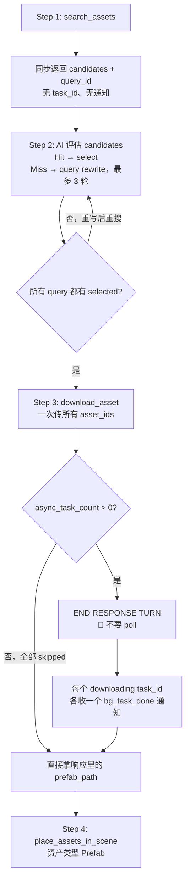

> ⚠️ **执行约束**
> - **主 agent**：无 `execute_custom_tool` 权限，必须 `task(subagent_name="search-assets", ...)` 委托，不要 `activate_skill` 后自己调。
> - **子代理（本文档主要读者）**：有权限，按下方 4-step pipeline 执行**到 Step 4**。

> ⛔ **`place_assets_in_scene` 调用规则**
> - **调用方式**：`activate_skill("unity-place-assets-in-scene")` → 按 §4a Prefab 模板用 `execute_csharp_script` 跑 `PrefabUtility.InstantiatePrefab`（**不是** `execute_custom_tool`，**不要** `unity_gameobject` 放 Prefab）。
> - **子代理**：Step 4 **必须执行**——对每个最终 `prefab_path` 调一次（资产类型 `Prefab`）。**每路径只调一次**：`skipped` 响应和 `<bg_task_done>` 通知合并去重。Final Report 告诉 caller 资产已在场景里（给出 GameObject 名），不要问"需要放到场景吗"。
> - **主 agent**：报告里的 `prefab_path` 是"已放置"的证据，不是"请你放置"的指示，**不要再调**。
> - **例外**：用户明确要"换位置 / 改 scale / 再放一个"时才再次调用。详见 [async-pattern §5.1](../../experience/templates/generator-async-pattern.md#51-place_assets_in_scene-调用规则)。

# Search & Download Unity Assets 🔍

从云端资产库搜索并下载 Unity 资产（prefab + 依赖），多个资产并行下载到项目。

Pipeline：**search（同步）→ evaluate（AI 决策）→ download（异步并行）→ place_assets_in_scene**

> **不是生成。** 用户想从零生成新资产 → `generate_3d_model` / `generate_sprite` / `generate_skybox` 等。

## 🚦 执行四步（不要跳读外链）

1. 调 `search_assets`（同步，无 task_id）→ 拿 `query_id` + 候选；AI 评估选出 `asset_ids`（评估失败时按 3 轮 rewrite 规则，**3 轮后必下载最佳候选**）
2. **一次调用** `download_asset`（`query_id` + 所有 `asset_ids` JSON 数组）→ 拿 `async_task_count` + `tasks[]`
   - 立即收集 `status: "skipped"` 任务的 `prefab_path`（无通知，立即可用）
3. **END RESPONSE TURN**（若 `async_task_count > 0`）— 不要 poll、不要 `query_download_status`
4. 下一轮每个 downloading task_id 各收一个 `<bg_task_done>` → 读 `prefab_path` → **对每个最终 prefab_path 调一次 `place_assets_in_scene`**（资产类型 `Prefab`，skipped 和 bg_task_done 来源合并去重）

**档位**：下载任务几十秒~几分钟；120 秒内无通知才允许 `query_download_status` 一次（**每个 task_id 仅一次**）。`URL_EXPIRED` → 重 `search_assets` 拿新 `query_id`；`interrupted` → 同参数重 `download_asset`（幂等）。完整 async 规则见 [generator-async-pattern](../../experience/templates/generator-async-pattern.md)。

## ⚠️ Skill 独有约束

1. **三段式 pipeline 不能跳步**——必须 search → evaluate → download → place。直接调 `download_asset` 不传 `query_id` 会失败。
2. **批量并行下载，不要串行**——一次 `download_asset` 调用传所有 `asset_ids`（JSON 数组字符串）；**不要**每个资产单独调一次。
3. **`async_task_count` 决定期待几个通知**——`download_asset` 响应里的 `async_task_count` 告诉你有多少个 `downloading` 任务（每个发一个通知）；`skipped` 任务不发通知。
4. **`URL_EXPIRED` 必须重新 search**——下载 URL 是签名+短期有效；过期后**不能复用旧 `query_id`**，必须重新调 `search_assets` 拿新 `query_id` 再下。
5. **`interrupted` 重试幂等**——同一 `query_id` + `asset_ids` 可安全重新提交，dedup 保护不会重复下载。
6. **三轮查询重写后必须下载**——评估失败 3 轮时也要选最好候选下载，**不要因"没完美命中"放弃**。
7. **失语义信号时不重试**——候选缺 `description`/`keywords` 时直接选最高 `score`，不进入三轮重写循环。
8. **`query_download_status` 每 task_id 仅一次**——不是每 skill 一次，是**每个 task_id** 各一次（120 秒后才允许）。

## When to Use / NOT to Use

适用：在云端资产库找现成的猫/椅子/飞船/道具/场景物件等。任何"找一个 / 下载一个 / 搜一下" 的请求。

不适用：
- 从零生成新 3D 模型（文/图生 3D） → `generate_3d_model`
- 从零生成 sprite / 图标 → `generate_sprite`
- 生成天空盒 / 音乐 / 材质 → 各自专属 skill

## 工作流



## ⛔ `execute_custom_tool` 调用格式（重要）

每次调 `execute_custom_tool` 都必须把 `tool_name` 作为**顶层字段**传，**不要**塞进 `parameters` 里：

```json
// ✅ 正确
{ "tool_name": "search_assets", "parameters": { "query": "spaceship", "top_k": 5 } }

// ❌ 错误：tool_name 嵌在 parameters 里 — 会报"tool_name is required"
{ "parameters": { "tool_name": "search_assets", "query": "spaceship" } }
```

## 工具

所有工具通过 `execute_custom_tool` 调用。

### `search_assets`（同步）

云端资产库搜索。**同步返回** candidates + `query_id`。支持单查询或批量。

```python
execute_custom_tool(
    tool_name="search_assets",
    parameters={
        "query": "spaceship",                         # 单查询（与 queries 互斥）
        # "queries": '["cat", "dog", "spaceship"]',   # 批量查询（JSON 数组字符串）
        "top_k": 5,                                   # 每个 query 候选数，默认 5
        # "filter_by_category": '["3d"]',             # 可选：限定类目
    }
)
```

| 参数 | 类型 | 必填 | 说明 |
|---|---|---|---|
| `query` | string | 二选一 | 单查询（与 `queries` 互斥） |
| `queries` | string (JSON 数组) | 二选一 | 批量查询，如 `'["cat","chair","spaceship"]'` |
| `top_k` | int | 否 | 每查询候选数，默认 5 |
| `filter_by_category` | string (JSON 数组) | 否 | 类目过滤，如 `'["3d","animation"]'` |

**返回（单查询）**：
```json
{
  "success": true,
  "query_id": "550e8400-...",
  "results": [
    {
      "asset_id": "abc123",
      "name": "Sci-Fi Spaceship",
      "category": "vehicles",
      "score": 0.92,
      "description": "Sci-fi spaceship with blue metallic material",
      "keywords": ["spaceship", "sci-fi", "vehicle"],
      "preview_url": "...",
      "prefab_path": "Assets/Vehicles/Spaceship.prefab"
    }
  ]
}
```

**返回（批量查询）**：每个 query 一组结果，`results` 是嵌套结构（`results[i].results[]`）。

> `description` / `keywords` 用于 AI 评估候选，缺失时回退用 `score` + `prefab_path` + `name`（**不要**触发重写重搜——信号不足）。

### `download_asset`（异步并行）

用 `query_id` + `asset_ids` 一次提交多个下载，**全部并行**。

```python
execute_custom_tool(
    tool_name="download_asset",
    parameters={
        "query_id":  search_result["query_id"],          # required
        "asset_ids": '["abc123", "def456", "xyz789"]',   # required: JSON 数组字符串
    }
)
```

**返回**：
```json
{
  "success": true,
  "notification_mode": "bg_task_done",
  "async_task_count": 1,            // 期待几个通知
  "tasks": [
    { "task_id": "download_1_...", "status": "downloading", "asset_id": "abc123", "name": "Cute Cat" },
    { "task_id": "download_2_...", "status": "skipped",  "asset_id": "xyz789",
      "prefab_path": "Assets/TJGenerators/DownloadedAssets/xyz789/Spaceship.prefab" }
  ]
}
```

> **`status: skipped`** = 该 asset_id 目录已存在，`prefab_path` 立即可用，**不会发通知**。`async_task_count` 只数 `downloading` 任务。

### `<bg_task_done>` 独有字段

通用字段见模板。本 skill **每个 task_id 各发一个通知**：

| 字段 | 说明 |
|---|---|
| `tool_name` | `"download_asset"` |
| `task_id` | 提交时返回的 `download_xxx` |
| `backend_task_id` | == `asset_id`（注意） |
| `asset_id` | 完成的资产 |
| `name` | 资产名 |
| `prefab_path` | **主要消费目标**，传给 `place_assets_in_scene` |
| `metadata_path` | 元数据 JSON 路径 |
| `category` / `source` | 资产分类与来源 |

**失败 payload**：`status: "failed"`，`error` 字段。常见错误：
- `URL_EXPIRED` → 重新 `search_assets` 拿新 `query_id`，再 `download_asset`
- `interrupted` → 用同 `query_id` + `asset_ids` 重新 `download_asset`（幂等）
- `TIMEOUT` / `PARSE_ERROR` / `ImportPackage failed` / `MoveAsset failed` → 看具体 message

### `query_download_status`（fallback only，**每 task_id 一次**）

```python
execute_custom_tool(
    tool_name="query_download_status",
    parameters={"task_id": "download_1_..."}
)
```

仅在 120 秒内通知未到达时调用，**每个 task_id 仅一次**。返回字段同通知 payload，外加 `progress_percent`、`imported_files`。

## 状态枚举

| Status | 含义 |
|---|---|
| `downloading` | 从 CDN 拉 `.unitypackage`（progress 0） |
| `importing` | 跑 `AssetDatabase.ImportPackage` 和 MoveAsset（progress 50） |
| `completed` | 下载、导入、prefab 移动完成；`AssetDatabase` 已自动 refresh（progress 100） |
| `skipped` | 资产目录已存在，直接用 `prefab_path`（progress 100，**无通知**） |
| `failed` | 整体失败，看 `error` |
| `interrupted` | domain reload 中断 — 重新调 `download_asset`（dedup 保护） |

## 候选评估规则

### `description` / `keywords` 都有

按 `score` + `description` + `keywords` 评估：

| score | 主体匹配 | 判定 | 动作 |
|---|---|---|---|
| ≥ 0.85 | description 匹配意图 | **完美命中** | 直接选 |
| ≥ 0.7 | 类型匹配 | **可接受** | 选并下载 |
| < 0.7 或类型明显错 | — | **未命中** | 触发 query rewrite |

### `description` / `keywords` 缺失

**直接选最高 `score` 的候选**，不重写重搜：
- `prefab_path` 文件名 / 目录、`name` 作为次要参考
- 立即下载——**不要触发 fallback 重试**（信号不足）
- 在结果里注："Semantic evaluation skipped (description/keywords absent)"

## Query Rewrite 规则

### 核心思想

**剥离修饰，保留骨架**——不是丰富描述，而是逐层剥掉 style/color/mood 等 weak modifiers，只留"资产类型 + 核心对象"。库里没有同款时，优先找**同类型**替代。

### 三轮 fallback

| 轮次 | 规则 | 例子 |
|---|---|---|
| **Round 1** | 用户原 query；只剥对话前缀（"I want a", "find me a"） | `pixel cartoon green pipe obstacle` |
| **Round 2** | 去 weak modifiers（style / color / weak descriptor），保留类型 + 核心对象 | `green pipe obstacle` |
| **Round 3** | 只留核心名词 + 类型骨架 | `pipe obstacle` |

### 保留优先级（高 → 低）

1. 资产类型词：obstacle / terrain / weapon / vehicle / building / character / prop / plant / UI icon
2. 核心对象词：pipe / spaceship / tree / sword / door / chest / car
3. 功能用途词：combat / decoration / platform / interactive / collectible
4. **可剥离词**：style / color / material / mood / 程度 / 形容词

### 三轮后的最终选择规则

- **必须下载**——3 轮后没完美命中，挑最佳候选下载，**不要因"没匹配"中止**
- 优先同类型；同类型内比核心对象接近度
- 没有同类型 → 选语义最近、`score` 最高的
- 风格/颜色/材质差异**不构成**否决理由
- "同类型不同风格" 永远比 "错类型" 更好

### 禁止

- ❌ 把 query 改长 / 加新词 / 引入用户没提到的对象
- ❌ 因风格颜色不符就否决同类型候选
- ❌ 提前剥掉"资产类型词"只留模糊形容词
- ❌ 3 轮后还不下载

## 使用示例

### 批量并行下载（推荐）

```python
import json

# Step 1: 批量 search — 一次调用，一个 query_id
result = execute_custom_tool(
    tool_name="search_assets",
    parameters={"queries": '["cat", "chair", "spaceship"]', "top_k": 5}
)
query_id = result["query_id"]

# → AI 评估每个 query 的候选，选出 cat_selected / chair_selected / ship_selected

# Step 2: 一次调用 fire 所有下载（内部并行）
dl = execute_custom_tool(
    tool_name="download_asset",
    parameters={
        "query_id":  query_id,
        "asset_ids": json.dumps([
            cat_selected["asset_id"],
            chair_selected["asset_id"],
            ship_selected["asset_id"],
        ]),
    }
)

# 立即拿 skipped 任务的 prefab_path（不发通知）
prefab_paths = {
    t["asset_id"]: t["prefab_path"]
    for t in dl["tasks"] if t.get("status") == "skipped"
}

async_count = dl.get("async_task_count", 0)
if async_count > 0:
    # ✅ END RESPONSE TURN — 等 async_count 个 bg_task_done 通知
    # 通知到达后从 payload 拿 prefab_path
    # status="failed" 且 error 含 "URL_EXPIRED" → 重新 search_assets
    # status="failed" 且 error 含 "interrupted" → 同 query_id+asset_ids 重新 download_asset
    pass
# 若 async_count == 0：全 skipped，直接进 Step 4

# Step 4: place_assets_in_scene 资产类型 Prefab
```

### 单查询 + 单下载

```python
result = execute_custom_tool(
    tool_name="search_assets",
    parameters={"query": "spaceship", "top_k": 5}
)
query_id = result["query_id"]

# AI 评估 → 选 best_candidate
dl = execute_custom_tool(
    tool_name="download_asset",
    parameters={
        "query_id": query_id,
        "asset_ids": f'["{best_candidate["asset_id"]}"]'
    }
)
# 等 1 个通知
```

## 放入场景

下载完成后，资产类型 **`Prefab`**，路径用通知 / 响应里的 `prefab_path`。这是 pipeline 的 Step 4，**整个任务只做一次**——主 agent 看到 `prefab_path` 不要再重复放置。规则见 [async-pattern §5.1](../../experience/templates/generator-async-pattern.md#51-place_assets_in_scene-调用规则)。

## 故障排查

### Skill 独有问题

| 问题 | 原因 / 解决 |
|---|---|
| `AUTH_REQUIRED` | 在 Unity Hub 或 Editor 账户面板登录 |
| `search_assets` 返回空 | 简化 query（剥修饰），或用更通用的词 |
| `download_asset` 任务 `success: false` | 看 `message`：`not found in query results` → 检查 `asset_id` 是否在 `search_assets` 结果里；`expired or not found` → 重新 search 拿新 `query_id` |
| `status: failed` + `URL_EXPIRED` | URL 短期签名已过期 → 重新 `search_assets`，拿新 `query_id`，再 `download_asset` |
| `status: failed` + `interrupted` | domain reload 中断 → 同 `query_id` + `asset_ids` 重新 `download_asset`（幂等） |
| 120 秒无通知 | `query_download_status` 每个 task_id 仅一次；不要循环 |
| `status: skipped` | 资产目录已存在 → 用响应里的 `prefab_path` 直接 place |
| `status: failed` 其他 | 看 `error`：`TIMEOUT` / `PARSE_ERROR` / `ImportPackage failed` / `MoveAsset failed` |
| 下载完成但 Unity 没看到资产 | 通常 `AssetDatabase` 自动 refresh；不行就手动 `Assets → Refresh` |
| 3 轮后还没完美命中 | **强制下载最佳候选**，不要中止 |

### Domain reload 后 task 丢失

通用恢复流程见 [generator-async-pattern §6](../../experience/templates/generator-async-pattern.md#6-domain-reload-recovery)。下载任务判定：

- 资产目录 `Assets/TJGenerators/DownloadedAssets/<asset_id>/` 存在且含 `.prefab` → 已下载完成
- 目录不存在或不完整 → 任务可能丢失，按 `interrupted` 处理（重新 `download_asset` 即可，dedup 保护）

可用 `glob("Assets/TJGenerators/DownloadedAssets/*/*.prefab")` 找已完成下载。

---

**Task ID Format**：`download_{counter}_{timestamp}`

**Notes**：
- `search_assets` 同步；`download_asset` 异步并行；`AssetDatabase.Refresh` 导入后自动跑
- 资产存到 `Assets/TJGenerators/DownloadedAssets/{asset_id}/`
- 导入完成后自动应用 `Session_{sessionId}` 标签（传入 `session_id` 时）
- 需 Unity Editor 在线运行；下载 URL 短期签名（过期需重 search）
- **"同类型不同风格" 永远好过 "错类型"**——不要用风格颜色否决候选
